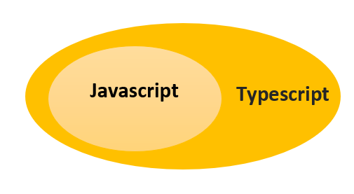

# Typescript

<details><summary><b>Introduction</b></summary>
<p>

JavaScript was introduced as a language for the client side. The development of Node.js has marked JavaScript as an emerging server-side technology too. However, as JavaScript code grows, it tends to get messier, making it difficult to maintain and reuse the code. Moreover, its failure to embrace the features of Object Orientation, strong type checking and compile-time error checks prevents JavaScript from succeeding at the enterprise level as a full-fledged server-side technology. TypeScript was presented to bridge this gap.

Typescript is a superset of Javascript




A TypeScript program contains:

* Modules
* Functions
* Variables
* Statements and Expressions
* Comments
</p>
</details>


<details><summary><b>Hello World! in Typescript</b></summary>
<p>

```
const msg:string = "Hello World!" 
console.log(msg)
```
</p>
</details>


<details><summary><b>Keywords in Typescript</b></summary>
<p>

| break | as | any | switch | case | if | throw |
| :---: | :---: | :---: | :---: | :---: | :---: | :---: |
| else | var | number | string | get | module | type |
| instanceof | typeof | public | private | enum | export | finally |
| for | while | void | null | super | this | new |
| in | return | true | false | any | extends | static | 
| let | package | implements | interface | function | new | try |
| yield | const | continue | do | catch |

</p>
</details>


<details><summary><b>Types in Typescript</b></summary>
<p>
TypeScript provides data types as a part of its optional Type System.

**Built-in types**

| Data type	| Keyword |
| :---: | :---: | 
| Number | number |
| String | string |
| Boolean | boolean |
| Void | void |
| Null | null |
| Undefined | undefined |

```
let a: number = 10;
let b: string = 'kamal';
let c: boolean = true;
```

**any**

The any data type is the super type of all types in TypeScript. It denotes a dynamic type. Using the any type is equivalent to opting out of type checking for a variable.

```
let d: any;
d= 'kamal';
```

</p>
</details>


<details><summary><b>Variables and Constants</b></summary>
<p>

We have 3 keywords for this in Typescript or Javascript.

| Keyword	|
| :---: |
| var |
| let |
| const |

**var** declarations are globally scoped or function scoped while **let** and **const** are block scoped. var variables can be updated and re-declared within its scope; let variables can be updated but not re-declared; const variables can neither be updated nor re-declared.

**without types**
```
var a = 'kamal';
const b = 10;
let c = 'kamal';
```

**with types**
```
var a: string = 'kamal';
const b:number = 10;
let c:string = 'kamal';
```

**if you don't know the type, use any**

```
let x: any;
x='kamal';
```

#### Scope

* Global Scope − Global variables are declared outside the programming constructs. These variables can be accessed from anywhere within your code.

* Class Scope − These variables are also called fields. Fields or class variables are declared within the class but outside the methods. These variables can be accessed using the object of the class. Fields can also be static. Static fields can be accessed using the class name.

* Local Scope − Local variables, as the name suggests, are declared within the constructs like methods, loops etc. Local variables are accessible only within the construct where they are declared.

```
var x = 12          //global variable 
class Kamal { 
   y = 13;             //class variable 
   
   testFunction():void { 
      var z = 14;    //local variable 
   } 
} 
```

</p>
</details>


<details><summary><b>Operators</b></summary>
<p>

| Arithmetic |  Comparison | Logical | 
| :---: | :---: | :---: |
| + | >  | && (and) |
| - | <  | \|\| (or) |
| * | >= | ! (not |)
| / | <= |  |
| % (mod) | == (equality without datatype) |  |
| ++ | !=  |  |
| -- | === (equality with datatype) |  |


**Other Operators**

| Operator | Detail | Example | 
| :---: | :---: | :---: |
| + | Concatenation | var a:string = 'hello'+'World' |
| ? : | Conditional | var x = a>10 ? 'greater' : 'smaller' |
|  |  |  |


</p>
</details>


<details><summary><b>Conditional Statements</b></summary>
<p>

**if**

```
const a:number = 10;
if (a>5){
	console.log('Hello. I'm here!')
}
```

**if.. else**

```
const a:number = 10;
if (a>5){
	console.log('Hello. I'm here!')
}else{
	console.log('Here I am')
}
```

**if.. else if**

```
var a:number = 2 
if(a > 0) { 
   console.log('a greater than 0') 
} else if(a < 0) { 
   console.log('a less than 0') 
} else { 
   console.log('a is 0') 
}
```

**switch case**

```
var x:string = "A"; 
switch(x) { 
   case "A": { console.log("Apple"); } 
   case "B": { console.log("Ball"); } 
   case "C": { console.log("Cat"); } 
   default: { console.log("Nothing"); } 
}
```

</p>
</details>


<details><summary><b>Loops</b></summary>
<p>

### For Loops

Typescript support 3 types of **FOR** loops.


* for loop
* for..of loop
* for..in loop


**for loop**

```
for (let i=0; i<10; i++){
	console.log(i*i);
}
```

Output :
```
0
1
4
9
16
25
36
49
64
81
```

**for .. of loop**

```
let itms = [11, 22, 33, 44, 55];
for (let itm of itms) {
  console.log(itm);
}
```

Output :
```
11
22
33
44
55
```

The for...of loop returns a character from string value.

```
let fullname = "Kamal Girdher";
for (let chr of fullname) {
  console.log(chr);
}
```

Output :
```
K
a
m
a
l
 
G
i
r
d
h
e
r
```


**for .. in loop**

```
let itms = [11, 22, 33, 44, 55];
for (let x in itms) {
  console.log(x);
}
```

	It prints indexes and not the values.
	
Output :
```
0
1
2
3
4
```

To print the values, you need to use 

```
let itms = [11, 22, 33, 44, 55];
for (let x in itms) {
  console.log(itms[x]);
}
```
Output :
```
11
22
33
44
55
```


### While loop

It has 2 flavors:

* while (condition) {..}
* do {..} while (condition)


**while**

```
let i: number = 1;

while (i <= 5) {
    console.log(i);
    i++;
}
```

Output:
```
1
2
3
4
5
```


**do .. while**

```
let i: number = 1;

do {
    console.log(i);
    i++;
} while (i <= 5) 
```

Output:
```
1
2
3
4
5
```

The difference is that it executes the statements at least once as it checks the condition after executing the block once.

</p>
</details>


<details><summary><b>Functions</b></summary>
<p>

**Basic function**
```
function sayhello() {
    console.log("Hello Kamal!");
}
```

**Function with parameters**
```
function sumOfTwo(x: number, y: number){
    console.log(x + y);
}
```


**Function with return type**
```
function getRandom() : number{
    return Math.round(Math.random()*100);
}

let a = getRandom();

console.log(a);
```

**Function with arguments and returning value**
```
function getSum(a: number, b: number) : number{
    return (a+b);
}

let a = getSum(5,10);

console.log(a);
```

**Function with optional parameters**
```
function sumOfTwoOrThree(a:number,b:number,c?:number) {
   if(c!=undefined) { return a+b+c; }
   else { return a+b; }
}

console.log(sumOfTwoOrThree(1,2));
console.log(sumOfTwoOrThree(1,2,3));
```

Output:
```
3
6
```

**Function with rest parameters**
```
function add(...nums:number[]) {  
   let sum:number = 0; 
   for(let i = 0;i<nums.length;i++) { 
      sum = sum + nums[i]; 
   } 
   console.log('Sum : ', sum) 
} 
add(1,2,3) 
add(1,2,3,4,5,6)
```

Output:
```
6
21
```

**Anonymous Function**

```
var result = function(a:number,b:number) { return a*b; }; 
console.log(result(12,2));
```

**Lambda Expression / Arrow function**


**without arguments**
```
var msg = ()=> { 
   console.log("Hi Kamal"); 
} 

msg();
```

Output :
```
Hi Kamal
```

**with arguments**
```
let sum = (x: number, y: number) => { x + y; }

sum(3, 4);
```

Output :
```
7
```


we would be using this very frequently while writing our tests in webdriverIO.


```
describe('Verify application loading', () => {
    it('should have the right title', () => {
        browser.url('https://extremeExcel.com')
        expect(browser).toHaveTitle('Extreme Automation - Kamal Girdher');
    })
})
```


</p>
</details>


<details><summary><b>Arrays</b></summary>
<p>


**Create an array**

```
var a = ['a','b','c','d'];
```


**concat()**

used to join arrays.

```
var a = ['a','b','c','d'];
var b = ['e','f'];

var c =a.concat(b);
console.log(c);
```

Output:
```
[ "a", "b", "c", "d", "e", "f" ] 
```


**every()**

Returns true if every element in this array satisfies the provided testing function.

```
function isEven(num: number) { 
   return (num % 2 == 0 ? true : false); 
} 
          
var result = [12, 10, 28, 130, 44].every(isEven); 
console.log(result);
```

Output:
```
true
```


**filter()**

creates a new array with all elements that pass the test implemented by the provided function.

```
function isEven(num: number) { 
   return (num % 2 == 0 ? true : false); 
} 
          
var result = [1, 10, 28, 13, 44].filter(isEven); 
console.log(result);
```

Output:
```
[ 10, 28, 44 ]
```


**forEach()**

calls the function for each element of the array.

```
[1, 10, 28, 13, 44].forEach( (x) => {console.log(x*x);}); 
```

Output :
```
1 
100 
784 
169 
1936
```

**indexOf()**

returns the first index at which a given element can be found in the array, or -1 if it is not present.

```
var index = [10, 20, 30, 40, 50].indexOf(30); 
console.log(index);
```

Output:
```
2
```

First element has index 0.


**join()**

used to join the array elements as string.

```
var arr = [10, 20, 30, 40, 50]
console.log(arr.join('-'));
```

Output:
```
10-20-30-40-50 
```


**lastIndexOf()**

returns the last index at which an element is found in the array. The array is searched backward direction.
returns -1 if the element is not present.

```
var index = [10, 20, 30, 40, 50, 10, 30, 40].lastIndexOf(10);
console.log(index);
```

Output:
```
5
```

**map()**

creates a new array after processing each element on array using the given function.

```
var arr = [1,2,3,4,5];
var result = arr.map( (x) => {return x*x;});
console.log(result);
```

Output :
```
[ 1, 4, 9, 16, 25 ] 
```


**push() & pop()**

push is used to add an element at end of the array.

pop is used to remove last element of the array.


```
var arr = [1,2,3,4,5];
arr.push(6);
console.log(arr);
arr.pop()
console.log(arr);
```

Output:

```
[ 1, 2, 3, 4, 5, 6 ] 
[ 1, 2, 3, 4, 5 ] 
```

**reduce()**

applies a function simultaneously against two values of the array (from left-to-right) as to reduce it to a single value.

```
var joinChars = ['A', 'B', 'C', 'D'].reduce(function(a, b, c){ console.log(a+b); return a + b; }); 
console.log("result : " + joinChars );
```

Output:
```
AB 
ABC 
ABCD 
result : ABCD 
```

**reduceRight()**

applies a function simultaneously against two values of the array (from right-to-left) as to reduce it to a single value.

```
var joinChars = ['A', 'B', 'C', 'D'].reduceRight(function(a, b, c){ console.log(a+b); return a + b; }); 
console.log("result : " + joinChars );
```

Output:
```
DC 
DCB 
DCBA 
result : DCBA
```

**reverse()**

reverses the order of elements of array.

```
var arr = ['A', 'B', 'C', 'D']
arr.reverse();
console.log(arr);
```

Output:

```
[ "D", "C", "B", "A" ]
```


**shift()**

Removes the first element from an array and returns that element

```
var arr = ['A', 'B', 'C', 'D']
console.log(arr.shift());
console.log(arr);
```

Output:
```
A 
[ "B", "C", "D" ]
```

**slice()**

extracts a section of an array and returns a new array.

```
var arr = ['A', 'B', 'C', 'D', 'E', 'F', 'G', 'H']
console.log(arr.slice(1,4))
```

Output:
```
[ "B", "C", "D" ] 
```

**some()**

Returns true if some element(s) in this array satisfies the provided testing function.

```
function isEven(num: number) { 
   return (num % 2 == 0 ? true : false); 
} 
          
var result = [1, 11, 28, 13, 47].some(isEven); 
console.log(result);
```

Output:
```
true
```


**sort()**

sorts the elements of the array in lexicographical order. To sort numbers, you can pass the function as argument.

```
var arr = ['banana','orange','apple','apricot']
console.log(arr.sort());
```

Output :
```
[ "apple", "apricot", "banana", "orange" ]
```


**splice()**

splice() method changes the content of an array, adding new elements while removing old elements.

```
var arr = ["A", "B", "C", "D", "E"];  
var removed = arr.splice(2, 2, "X");  
console.log(arr);
console.log(removed);
```

Output:
```
[ "A", "B", "X", "E" ] 
[ "C", "D" ] 
```


**toString()**

```
var arr = ["A", "B", "C", "D", "E"];  
console.log(arr.toString());
```

Output:
```
A,B,C,D,E 
```

**unshift()**

```
var arr = ["A", "B", "C", "D", "E"];  
arr.unshift('X','Y');
console.log(arr);
```

Output:
```
[ "X", "Y", "A", "B", "C", "D", "E" ]
```
</p>
</details>


<details><summary><b>Classes & Objects</b></summary>
<p>
</p>
</details>


<details><summary><b>Modules</b></summary>
<p>
</p>
</details>


